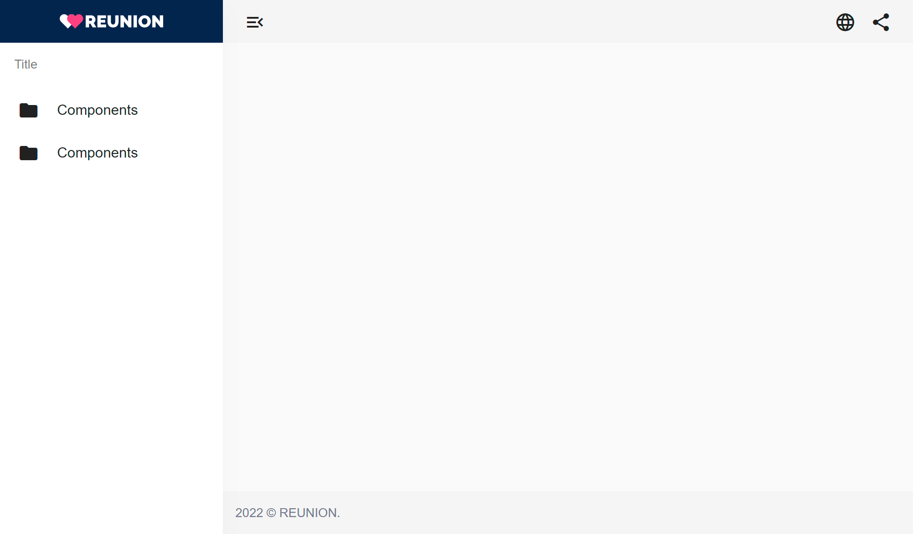

# Reunion Angular Admin Template

Angular 13 starter admin dashboard template. Includes Angular Material, Sidenav, Drawer, Header, Footer and Sidebar. Routing and admin modules are also setup.



### 📥 Clone project

Clone the project from github or download the .zip file and extract to your existing project.
```bash
$ git clone https://github.com/talentedaamer/reunion-admin-template.git
```

### 📦 Package Installation

Install packages.
```bash
$ npm install
```

## 🚀 Running, Building, Testing the app

```bash
# start
$ npm run start
# build
$ npm run build
# watch
$ npm run watch
# test
$ npm run test
```

### License

This project like Nest is [MIT licensed](LICENSE).
